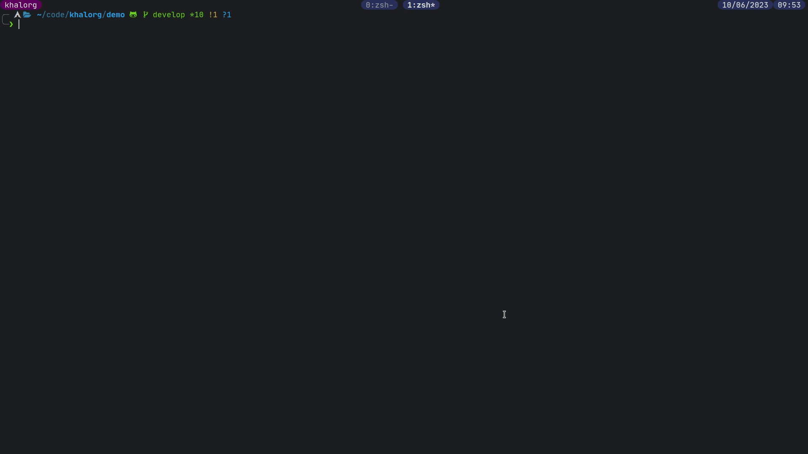
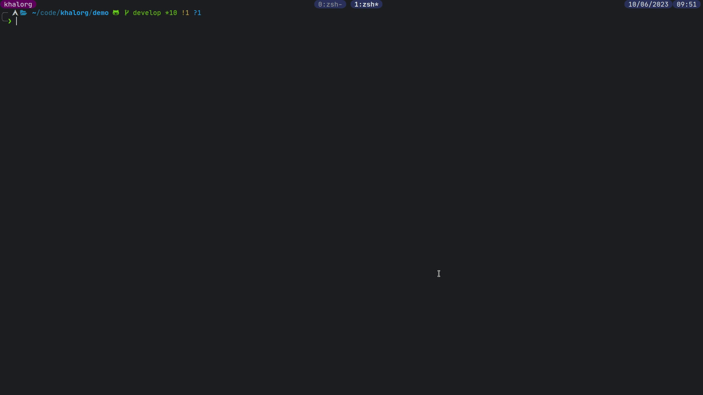
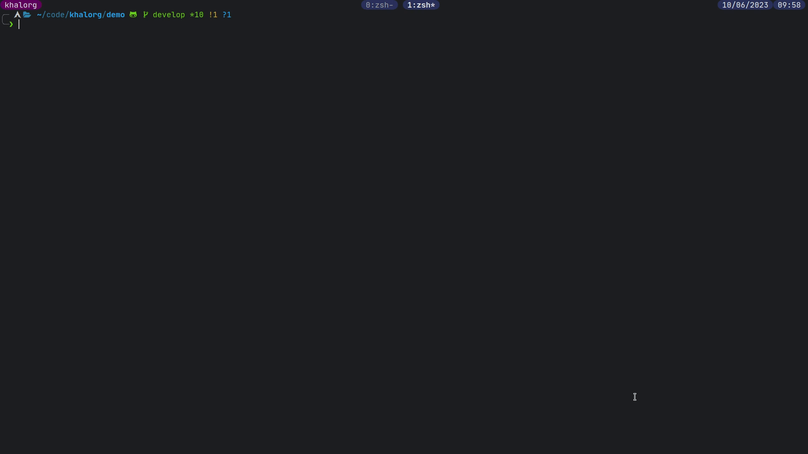

[Click here for the GitHub page.](https://github.com/BartSte/khalorg) 

# Introduction
`khalorg` is an interface between Org mode and Khal cli calendar.

## Definitions
- [CalDav](<https://en.wikipedia.org/wiki/CalDAV>): internet standard for client access to calendars
- [Davmail](<https://davmail.sourceforge.net/e>): CalDav exchange gateway
- [khal](<https://github.com/pimutils/khal>): command line calendar app 
- [khalel](<https://gitlab.com/hperrey/khalel>): interface between emacs and khal
- [nvim-orgmode](<https://github.com/nvim-orgmode/orgmode>): org mode for neovim
- [org](<https://orgmode.org>): plain text system for keeping notes, agendas and more
- [vdirsyncer](<https://github.com/pimutils/vdirsyncer>): synchronizes calendars and addressbooks between servers and the local file system

## Motivation
I use org mode to manage my agenda and my notes. However, in a professional
setting, you are often required to use proprietary software for your agenda,
like Office 365. Luckily, programs exist that can synchronize agendas from
different sources, by implementing the CalDav standard. Personally, I like to
use `vdirsyncer` with `khal` to synchronize my agendas. To bridge the gap
between `khal` and `org mode`, only 1 program exists called: `khalel`. However,
this program is designed for `emacs`. Since there are also org mode users
outside of `emacs` (e.g. `neovim`), `khalorg` aims to be a general interface
between `vdirsyncer`/`khal` and `org mode`.

Based on the above, the following workflow is desired:

``` example
┌──────┐     
│CalDav│     
└┬─────┘     
┌▽─────────┐  
│vdirsyncer│  
└┬─────────┘  
┌▽───┐        
│khal│        
└┬───┘        
┌▽───────┐
│khalorg │
└┬───────┘
┌▽───────┐    
│org mode│    
└────────┘    
```

## Features
- [x] Can be used by org mode for emacs, vim and neovim.
- [x] Vdirsyncer calendars can be manipulated by using the cli of `khal`
  as the interface.
- [x] `khalorg new`: convert an org agenda item into a `khal` agenda
  item.
- [x] `khalorg list`: convert a `khal` agenda item into an org agenda
  item.
- [x] `khalorg edit`: edit an existing `khal` agenda item with org mode.
- [x] `khalorg delete`: delete an existing `khal` item.
- [x] Recurring items are supported by providing an org repeater in the
  time stamp (e.g., `+1w`). The following is supported:
  - the follow org repeaters: `+{integer}{d,w,m,y}`
  - `khalorg new` and `khalorg edit --edit-dates` support 1 time stamp
    per org agenda item.
  - `khalorg list` concatenates timestamps that cannot be describes by
    an org repeater, resulting in an org agenda item with multiple
    timestamps.
  - Supports an `until` date for recurring items. The until date can be
    supplied through an org property `UNTIL`.
- [x] Has unittests
- [x] Includes an Office 365 workflow with a bash script
- [x] Semantic versioning
- [x] Gifs with demos
- [x] Neovim plugin
- [x] Is available on PyPI

# Dependencies
- khal>=0.11
- vdirsyncer
- orgparse

# Installation
For safety, always make a back-up of your calendar before installing software
that is new to you.

Make sure your `khal` date format is compatible with org, otherwise it
will not work. When running `khal printformats` you should get:
```
    longdatetimeformat: 2013-12-21 Sat 21:45
    datetimeformat: 2013-12-21 Sat 21:45
    longdateformat: 2013-12-21 Sat
    dateformat: 2013-12-21 Sat
    timeformat: 21:45
```
If not, check the documentation of `khal` on how to change this.

## PyPi (in progress)
``` bash
pip install khalorg
```

## From source
Set your current working directory to the root directory, i.e, the
directory containing the `pyproject.toml` file. Next, run:

``` bash
pip install .
```
After this, the executable `khalorg` will be available.

## For development
If you want to develop the code, debug it, and test it, run:
``` bash
pip install -e '.[test,debug]'
```

# Usage
Use `khalorg --help` to get information about the cli of `khalorg`. The
following section discuss the `khalorg` commands that are available.

## List: from khal to org



Agenda items from `khal` can be converted to org items using the
`khalorg list` command. For examples:

``` bash
khalorg list my_calendar today 90d > my_calendar.org 
```

Here, the `khal` agenda items of the calendar `my_calendar` are
converted to org format and written to a file called `my_calendar.org`.
The range is specified from `today` till `90d` (90 days) in the future.
For more information about the allowed date formats, check the
`khal list` command, which is used for this functionality. It is assumed
that the `khal` calendar called `my_calendar` exists. Make sure
`my_calendar` is a calendar that exists on your local file system.

### –format
If `khalorg list --format` option is not defined, the default one is
used which can be found at `./khalorg/static/khalorg_format.txt`. If you
want to define your own format, you have 2 options: you can use the
`khalorg list --format` option, or you can place your custom format at
`$HOME/.config/khalorg/khalorg_format.txt` this format will then be used
instead of the default one that is shown below.

``` txt
* {title}
{timestamps}
:PROPERTIES:
:ATTENDEES: {attendees}
:CALENDAR: {calendar}
:CATEGORIES: {categories}
:LOCATION: {location}
:ORGANIZER: {organizer}
:STATUS: {status}
:UID: {uid}
:URL: {url}
:END:
{description}
```

the following keys are supported:
- `{attendees}`: a comma separated list of email addresses of attendees
- `{calendar}`: the name of the khal calendar
- `{categories}`: the categories property of the item
- `{description}`: the description of the item
- `{location}`: the location of the item
- `{organizer}`: the email of the organizer
- `{status}`: the status of the item, e.g., TENTATIVE or ACCEPTED
- `{timestamps}`: the timestamp of the item
- `{title}`: the summary of the item
- `{uid}`: the UID of the item
- `{rrule_until}`: the until value of the RRULE.
- `{url}`: the url property

the following keys are supported but are typically reserved for internal use
and are therefore less informative:

- `{until}`: the until property value. Is empty when using `khalorg list`.
- `{rrule}`: the ICal RRULE of the item.

### Recurring items

The `khalorg list` command relies on the `khal list` command. Using this
command the `RRULE` of each item is retrieved to created the correct org
repeater. Only simple org repeaters are supported that have the
following form: `+[number][h,w,m,y]`. Complex `RRULEs` are described by
concatenating the corresponding timestamps within 1 agenda item,
resulting in a list of items. For example, the agenda item below
represents a weekly recurring event where the first meeting was moved to
another date, resulting in a timestamp without a repeater, and one with
a repeater.

``` example
* Meeting
<2023-01-05 Thu 01:00-02:00>
<2023-01-08 Sun 01:00-02:00 +1w>
:PROPERTIES:
:UID: 123
:LOCATION: Somewhere
:ORGANIZER: Someone (someone@outlook.com)
:ATTENDEES: test@test.com, test2@test.com
:URL: www.test.com
:END:
Hello,

Lets have a meeting.

Regards,


Someone
```

## New: from org to khal



An org agenda item can be converted to a new `khal` agenda item by
feeding the org item through stdin to `khalorg new` and specifying the
khal calendar name as a positional argument. For example, the consider
the org item below, which is saved as `meeting.org`.

``` example
* Meeting
<2023-01-01 Sun 01:00-02:00 +1w>
:PROPERTIES:
:UID: 123
:LOCATION: Somewhere
:ORGANIZER: Someone (someone@outlook.com)
:ATTENDEES: test@test.com, test2@test.com
:URL: www.test.com
:END:
Hello,

Lets have a meeting.

Regards,


Someone
```

This item can be converted to the `khal` calendar called
"my<sub>calendar</sub>" as follows:

``` bash
cat meeting.org | khalorg new my_calendar
```

It is assumed that the `khal` calendar called "my<sub>calendar</sub>"
exists. Make sure "my<sub>calendar</sub>" is a calendar that exists on
your local file system.

### Recurring items
Only 1 timestamp per org item is supported. Note that the meeting above
is repeated every week (`+1w`). Only simple org repeaters are supported
that have the following form: `+[number][h,w,m,y]`. These events repeat
forever, unless you specify an end date using the \`UNTIL\` property in
the org file.

Personally, when I need to create a complex repeat pattern (or when I
need outlook specific items like a Teams invite), I create the event in
outlook first. Next, I use `khalorg edit` to change the fields that need
editing (e.g., the description).

### Attendees
Optionally, attendees can be added to the `ATTENDEES` property field.
The attendees will be added to the `Attendees` field of `khal`. Once you
synchronize `khal` with a server (e.g., outlook) an invitation will be
send to the attendees.

## Edit



Existing `khal` events can be updates by feeding an org file with the
corresponding UID through stdin to the `khalorg edit` command. For
example, the org agenda item of <span class="spurious-link"
target="New">*New*</span> can be altered and used as an input for
`khalorg edit`, as long as the UID remains untouched.

``` example
* Edited meeting
<2023-01-01 Sun 01:00-02:00 +1w>
:PROPERTIES:
:UID: 123
:ORGANIZER: Someone (someone@outlook.com)
:ATTENDEES: other@test.com
:END:
Hello,

I edited the meeting by removing the location and url. I also changed the
title and the attendees field.

Regards,


Someone
```

Next, run the following command:

``` bash
cat meeting.org | khalorg edit my_calendar
```

When using `khalorg edit` please consider the following:

- Editing an existing event is different from creating a new one as the
  original `icalendar` file is retained. Only parts of it are altered.
  This is convienent when the icalendar file contains information that
  cannot be generated by `khalorg`. For example, a Microsoft Team
  meeting.
- Only the PROTO event is edited, i.e., the whole series is altered not
  only the occurence.
- `khal edit` will only update the dates + recurrence if the
  `--edit-dates` flag is passed. This avoids editing the start-stop date
  when editing an event that contains multiple timestamps (which are not
  supported).

## Delete:
 


An event can be deleted from a khal calendar by feeding an org file to the
`khalorg delete` command through stdin. The org file must contain an agenda
item with a non-empty UID property. For example, the khal event that was
created using the <span class="spurious-link" target="New">*New*</span> command
above can be removed by feeding the same file to `khalorg delete`:

``` bash
cat meeting.org | khalorg delete my_calendar
```

### Recurring items
When deleting recurring items the whole series will be removed. Removing
occurrences is not supported.

## Neovim plugin
The neovim plugin can be found here: [nvim-khalorg](https://github.com/BartSte/nvim-khalorg).

# Workflow for Office 365
The diagram below illustrates the workflow than can be achieved when using
`khalorg`. The folder `extras`, on the
[GitHub](https://github.com/BartSte/khalorg) page, contains a `bash` script
called `calsync`, that synchronizes `vdirsyncer` calendars and exports them as
an org file using the `khalorg list` command. Davmail is used as the CalDav
server in this specific example.

``` example
┌──────────┐  
│Office 365│  
└┬─────────┘  
┌▽──────┐     
│Davmail│     
└┬──────┘     
┌▽─────────┐  
│vdirsyncer│  
└┬─────────┘  
┌▽───┐        
│khal│        
└┬───┘        
┌▽───────┐
│khalorg │
└┬───────┘
┌▽───────┐    
│org mode│    
└────────┘    
```

# Improvements:
- [ ] Timezones are not yet supported, so `khalorg` will only work when
  you agenda remain in the timezone that you specified within your
  `khal` config.
- [ ] Running khal commands directly from a script in not
  straightforward. Therefore, khal is executed as a subprocess, by using
  its command line interface.
- [ ] `khalorg new` and `khal edit` only support 1 timestamp per item.
  However, it is desired that all timestamps within 1 org agenda item,
  end up in 1 khal event, as is the case for the `orgagenda`. To achieve
  this the following could be build:
  - [ ] When multiple timestamps without an org repeater are provided,
    find the `RRULE` that describes them. Also, set the `UNTIL` date to
    the last date. If no `RRULE` can be found, raise an error. Another
    option could be to use the `RDATE` option of ICal.
  - [ ] When multiple timestamps with an org repeater are presented, try
    to find the `RRULE` that describes them.
